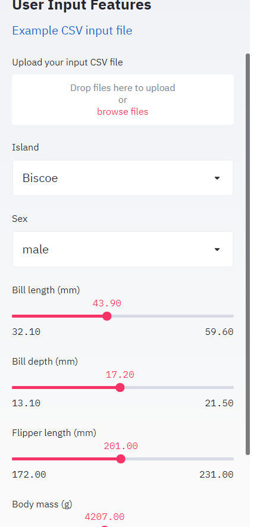
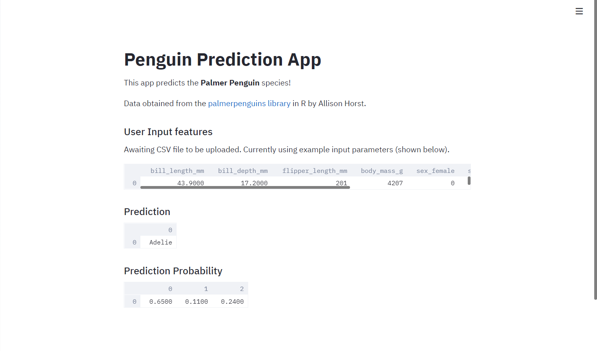
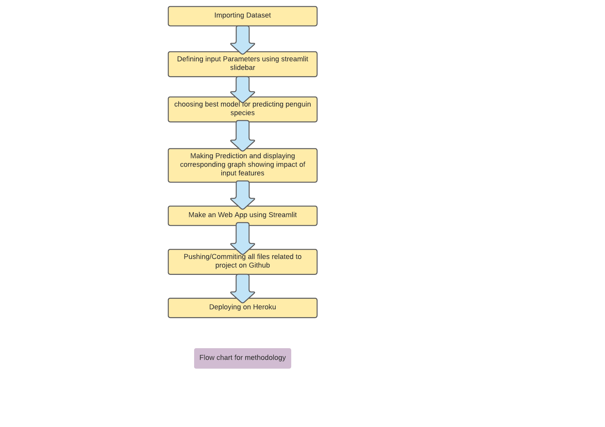

# Penguins web app deployed on Heroku

The deployed web app is live at https://penguindsproject.herokuapp.com/

This web app predicts the species of penguins as a function of their input parameters (bill length, bill width, flipper length, body mass, sex and island).

The web app was built in Python using the following libraries:
* streamlit
* pandas
* numpy
* scikit-learn
* pickle

# Screenshots of I/O

<table style="width:100%">
  <tr>
    <th></th>
    <th></th>
  </tr>
 </table>

# Flow Chart

<table style="width:100%">
  <tr>
    <th></th>
  </tr>
 </table>
 

Made by Shivanu Sharma(101803045)
